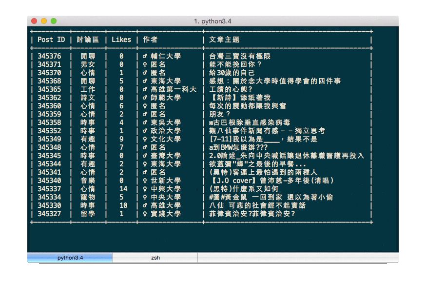

# Pydcard
This is a Dcard API wrapper

### Overview

Pydcard is a Python wrapper for accessing the Dcard API.

**Pydcard only support in Python 3**


### Installation

The current release of Pydcard is available through [PyPi](https://pypi.python.org/pypi/pydcard):

```
pip install pydcard
```

### Dependencies

`pip` does install dependencies

- [requests](https://github.com/kennethreitz/requests)

### Usage

The basic usage

```
import pydcard
from pprint import pprint

# Get top posts in *all* forum from Dcard. The parameter is page number.
page_one = pydcard.get_all_top_posts(1)

# Each page have 20 threads, now get the id in index 0.
# i.e. the first thread's id.
th_one_id = page_one[0].get('id')

# Using thread id to get the post content
pprint((pydcard.get_post(th_one_id)))
```

The complicated example (Need to install [prettytable](https://pypi.python.org/pypi/prettytable) package)



### API

- **get_post(post_id)**

    Getting post content by post ID.

- **get_all_top_posts(to_page_num)**

    Getting top posts from *all* forum. From page 1 to page `to_page_num`.

- **get_all_new_posts(to_page_num)**

    Getting recently posts from *all* forum. From page 1 to page `to_page_num`.

- **get_all_page(page_num)**

    Getting recently posts from *all* forum, only one page.

### Related

- See Node.js Dcard API wrapper package in [npm](https://www.npmjs.com/package/dcard).
